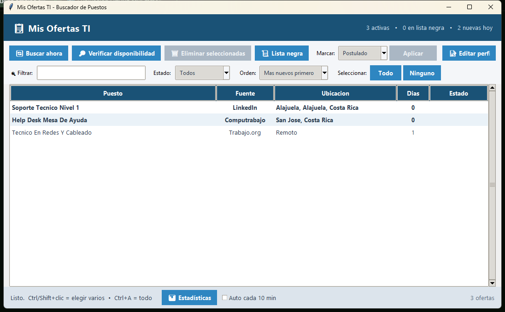
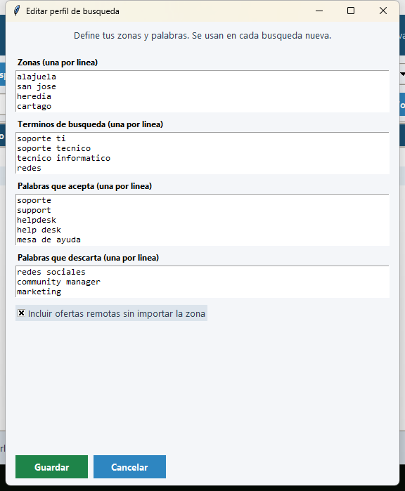

# Buscador de Puestos — Soporte TI / Redes

[](https://github.com/MREmmanuel09/BucadorDePuestos/actions/workflows/ci.yml)
[](LICENSE)
[](https://www.python.org/)

Herramienta de escritorio en Python (solo biblioteca estandar) que busca ofertas de
trabajo en **Computrabajo, Trabajo.org, FindJob24h y LinkedIn**, las filtra segun tu
perfil (palabras clave, zonas y remoto) y te ayuda a no perder el seguimiento.

## Funciones

- **Aplicacion de escritorio** (Tkinter): buscar ahora, verificar disponibilidad,
  eliminar ofertas, ver/restaurar la lista negra, marcar *Postulado* / *Descartado*,
  ordenar por fecha (mas nuevos / mas viejos), seleccion en masa (`Todo` / `Ninguno`),
  **editar tu perfil** sin tocar archivos, ventana de **estadisticas** (estados,
  ultimos 7 dias y fuentes) y **busqueda automatica** opcional cada N minutos.
- **Filtro inteligente**: palabras que acepta, palabras que descarta, zonas y modo remoto.
- **Lista negra de 15 dias**: lo que eliminas no vuelve a aparecer en ese plazo.
- **Deteccion de ofertas cerradas**: solo con evidencia positiva (fecha vencida,
  pagina 404/410, mensaje "ya no se aceptan solicitudes"...); un error de red
  **nunca** borra nada.
- **Busqueda automatica diaria** opcional con el Programador de tareas de Windows,
  notificaciones de Windows y reporte HTML de solo lectura.

## Requisitos

- Windows y **Python 3.10+** de https://www.python.org/ (marca *Add python.exe to PATH*).
- Sin dependencias externas: no hay que instalar nada con pip.

## Primeros pasos

1. Clona o descarga el repositorio.
2. Doble clic en **`Abrir Ofertas.cmd`** (o icono del escritorio si lo creas).
3. Pulsa **Editar perfil** y pon tus zonas y palabras.
4. Pulsa **Buscar ahora**.

En el primer arranque se crea `buscador/config.json` a partir de
`buscador/config.example.json`. Ese archivo es **tu copia local** y esta ignorado
por Git (junto con `buscador/data/`, donde quedan tus ofertas, lista negra e historial).

## Capturas

**Aplicacion principal** — tabla con filtros, estados y en el pie los botones de
estadisticas y busqueda automatica:



**Editar perfil** — zonas, terminos de busqueda, palabras que acepta/descarta y
modo remoto:



## Estructura

Todo el codigo esta documentado en espanol (docstring en cada funcion) y la guia
completa de como funciona esta en **[MAPA_DEL_CODIGO.md](MAPA_DEL_CODIGO.md)**.

```
buscador/
  app.pyw            # aplicacion de escritorio (interfaz principal)
  main.py            # busqueda, filtros, lista negra, reporte
  verificar.py       # deteccion de ofertas cerradas (evidencia positiva)
  eliminar.py        # borrado por terminal (avanzado)
  config.example.json# plantilla de configuracion (versionada)
  fuentes/           # conectores: computrabajo, trabajo_org, findjob24h, linkedin
  data/              # datos locales (ignorado por Git)
docs/                # capturas de la aplicacion
tests/               # pruebas unitarias (unittest)
.github/workflows/   # integracion continua (CI)
```

## Aviso

Uso personal: las fuentes se consultan publicamente con pausas entre solicitudes y
pueden cambiar sin aviso. Respeta los terminos de uso de cada sitio.

## Licencia

Distribuido bajo la licencia **MIT** — ver [LICENSE](LICENSE). Puedes usarlo,
modificarlo y compartirlo libremente (incluso con fines comerciales), conservando
el aviso de copyright.
